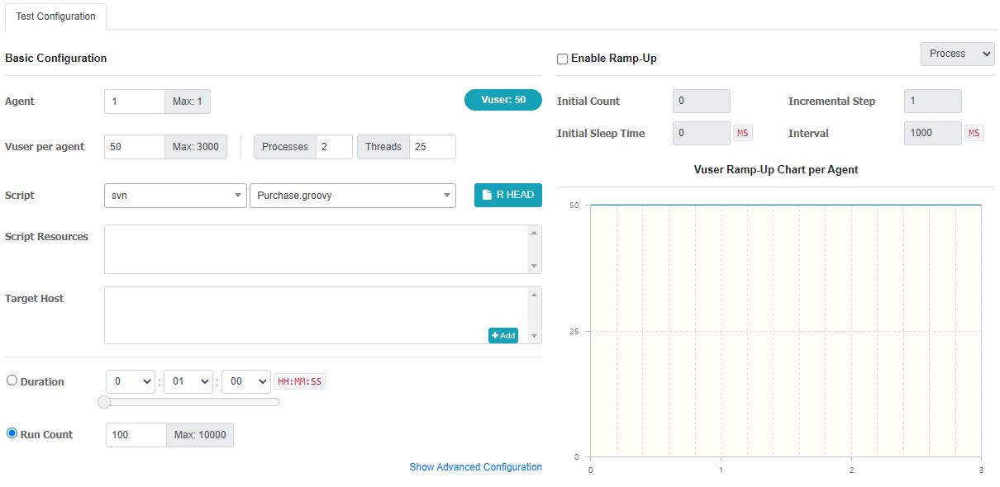

# 동시성 문제 테스트

### 1. 테스트 개요
  - **목적**: 여러 사용자가 동시에 구매 API를 사용할 때 발생할 수 있는 동시성 문제를 확인하기 위해 테스트를 진행하였습니다.
  - **테스트 환경**:     
      - 재고: 5000개
      - nGrinder 설정:
          - Agent: 1
          - Vuser per agent: 50
          - Run Count: 1000
       


### 2. 테스트 시나리오
  - 여러 사용자가 동시에 상품을 구매하는 상황을 시뮬레이션하였습니다.

### 3. 테스트 결과
  - 구매 기록 : 15,668건의 주문이 기록되었습니다. (구매 성공 비율: 약 1,567%)
  - 재고 상태:  설정한 재고는 5,000개였지만, 426개의 재고가 남아 있는 상황입니다.
      - 판매된 재고: 4,574개 (판매된 재고 비율: 약 91.48%)
      - 남은 재고: 426개 (남은 재고 비율: 약 8.52%)


```mysql
  SELECT COUNT(*) FROM orders WHERE order_date > '2024-11-26 22:42:10';
  SELECT stock FROM products WHERE id = 5;
```


### 4. 문제 분석
  - **동시성 문제**: 여러 사용자가 동시에 주문을 시도하면서, 재고가 부족한 상태에서도 주문이 처리되는 문제가 발생하였습니다.
  - **원인**: 주문 처리 로직에서 재고를 확인하고 감소시키는 과정이 동시에 이루어지지 않아, 중복된 주문이 발생하였습니다.

### 5. 결론 및 해결 방안
  -  **결론**:
      - 동시성 테스트 결과, 15,668건의 주문이 기록되었으며, 이는 총 요청 수에 대한 구매 성공 비율이 약 1,566.8%에 해당합니다.
      - 설정한 재고 5,000개 중 426개가 남아 있는 상황이 발생하였습니다.
      - 이는 동시성 문제로 인해 재고 관리가 제대로 이루어지지 않았음을 나타냅니다.
      - 판매된 재고는 4,574개로, 판매된 재고 비율은 약 91.48%입니다.

  -  **해결 방안**:
      - **트랜젝션 관리 강화**: 주문 처리와 재고 감소를 하나의 트랜잭션으로 묶어, 두 작업이 모두 성공해야만 커밋되도록 합니다.
      - **적절한 락 사용**: 재고를 업데이트할 때 데이터베이스에서 적절한 락을 사용하여 여러 사용자가 동시에 접근하지 못하게 제한합니다.
