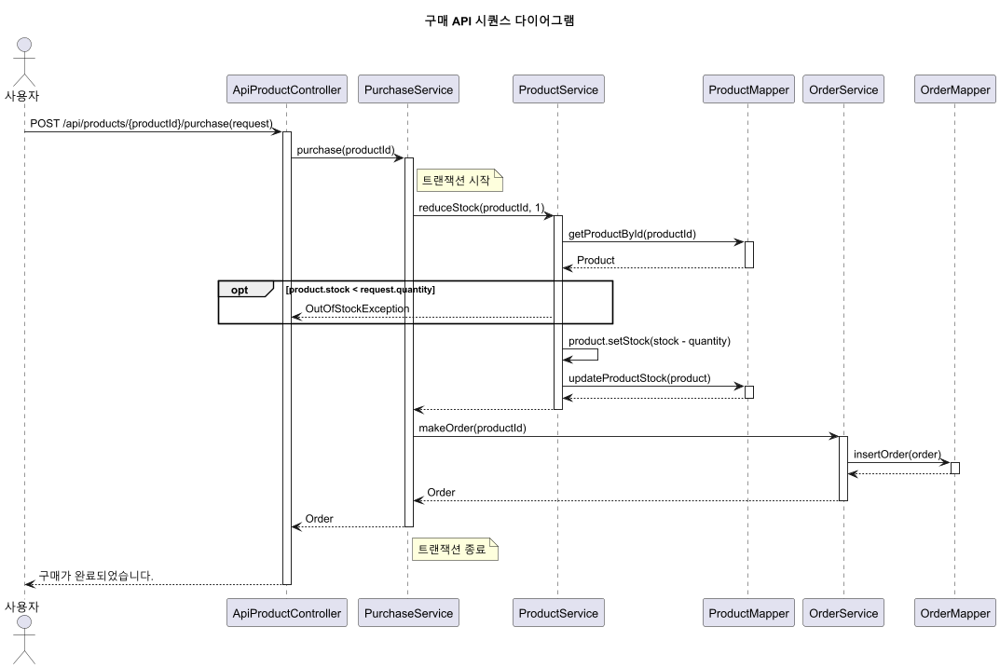

# 동시성 문제

## 1. 구매 기능 구현
  - 구매 API를 개발, 시퀀스는 아래와 같으며 이러한 시퀀스를 통해 구매가 이루어지고 재고가 차감이 됩니다.<br>


## 2. 대규모 구매 테스트

### 1. 테스트 시나리오
  - 쇼핑몰에서 이벤트를 열어서 다수의 유저가 선착순으로 구매하는 상황을 테스트로 진행하였습니다.

### 2. nGrinder Setting       


### 3. 테스트 결과 (동시성 문제 발생)
  - 구매 기록 : 1,654건의 주문이 기록되었습니다. (구매 성공 비율: 약 331%)
  - 재고 상태:  설정한 재고는 500개였으며, 남은 재고는 0개입니다. (판매된 재고 비율: 100%)


```mysql
SELECT 
    (SELECT COUNT(*) FROM orders WHERE order_date > '2024-12-01 02:07:00') AS order_count,
    (SELECT stock FROM products WHERE id = 1) AS product_stock;
```


### 4. 왜 이런 일이 일어났는가?          
  - 다수의 유저가 거의 동시에 데이터베이스에 접근하면서 같은 재고를 조회하고 재고 차감하는 과정에서 재고가 차감되기 전에 근사하게 데이터베이스에 접근한 유저가 재고 조회를 하고 재고를 차감하면서 재고가 덮어씌워지는 일이 발생했습니다.<br>
  
  

다음편 : DB락을 통한 동시성 제어
